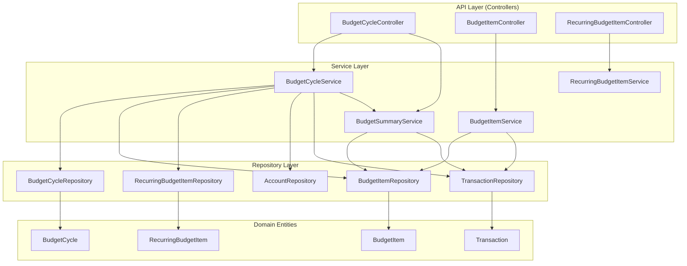
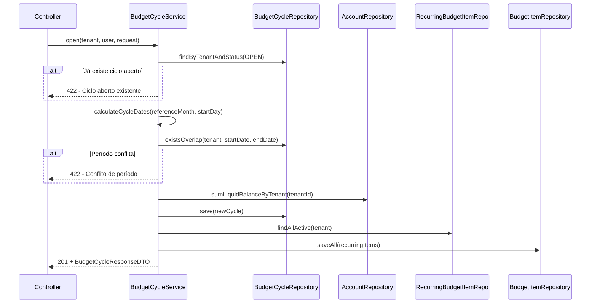
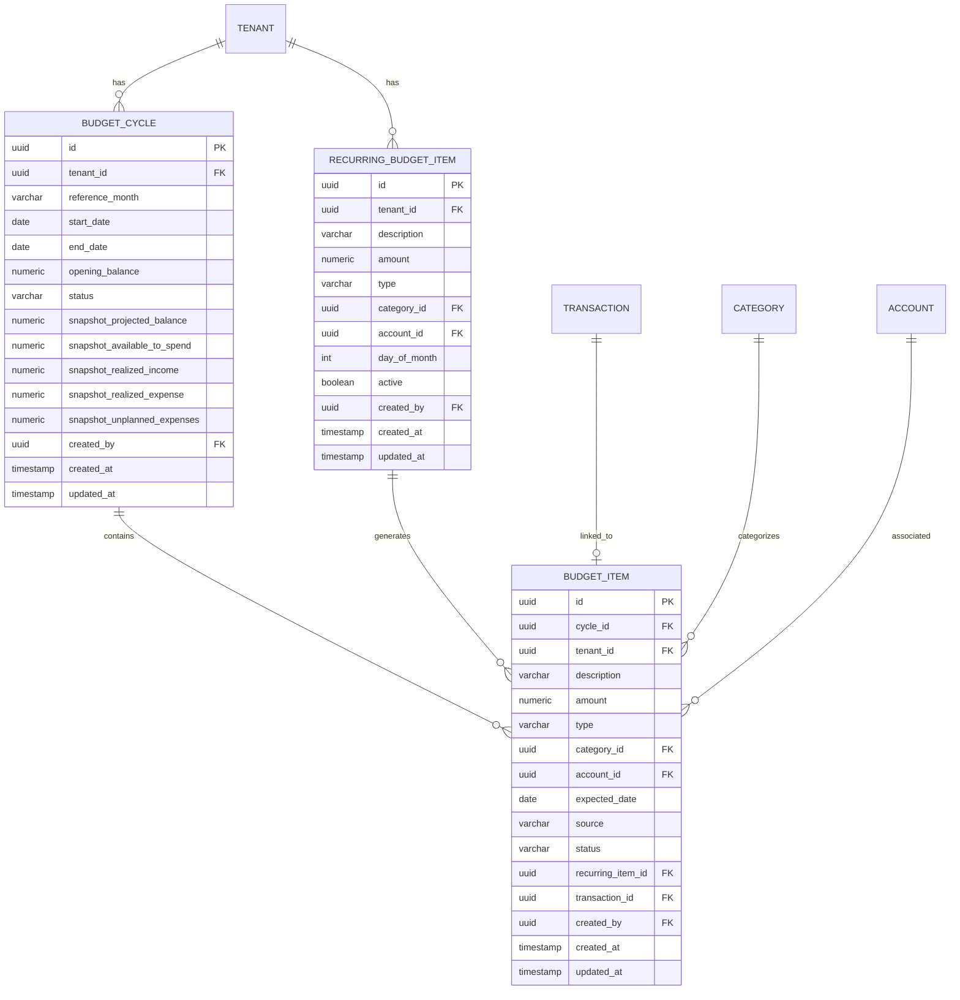

# Design Document

## Overview

Este documento descreve o design técnico para a funcionalidade de planejamento de ciclo orçamentário mensal. A solução evolui o módulo de orçamento existente (`budget_cycles`, `budget_items`, `recurring_budget_items`) adicionando:

1. **Cálculos de resumo aprimorados** — Saldo Projetado, Disponível Para Gastar, Mesada Diária e detecção de Gastos Não Planejados
2. **Gerenciamento completo de status** — Transições PENDING ↔ SKIPPED, realização com criação/vinculação de transação, e validações de estado
3. **Snapshot de fechamento** — Persistência imutável do resumo ao fechar ciclo
4. **Validações de negócio refinadas** — Regras de tipo compatível, ciclo fechado, data dentro do período, e isolamento multi-tenant uniforme (403 sem revelar existência)

A implementação segue o padrão existente: Controller → Service → Repository, com DTOs dedicados para request/response, Flyway para migração, e mock-based testing.

### Decisões de Design

| Decisão | Rationale |
|---------|-----------|
| Snapshot como colunas na tabela `budget_cycles` | Evita tabela extra; o snapshot é 1:1 com ciclo e imutável após fechamento |
| Gastos Não Planejados calculados via query (não persistidos) | São dinâmicos até o fechamento; depois, o snapshot preserva o total |
| Mesada Diária calculada on-demand (não persistida) | Muda diariamente; não faz sentido armazenar |
| `referenceMonth` como campo no ciclo | Permite identificação rápida do ciclo sem recalcular datas |
| Reuso das entidades existentes (evolução, não substituição) | Minimize breaking changes no schema e no frontend |
| Unificar realização com/sem transação no mesmo endpoint | Simplifica a API — `transactionId` nullable no request decide o comportamento |

## Architecture



### Fluxo de Criação de Ciclo



## Components and Interfaces

### Controllers (evolução dos existentes)

#### BudgetCycleController

| Método | Endpoint | Descrição |
|--------|----------|-----------|
| `open()` | `POST /api/budget-cycles` | Cria ciclo (já existe) |
| `list()` | `GET /api/budget-cycles` | Lista paginada (já existe, ajustar size máx 50) |
| `get()` | `GET /api/budget-cycles/{id}` | Detalhes com resumo completo |
| `current()` | `GET /api/budget-cycles/current` | Ciclo aberto atual |
| `close()` | `POST /api/budget-cycles/{id}/close` | Fecha ciclo com snapshot |

#### BudgetItemController

| Método | Endpoint | Descrição |
|--------|----------|-----------|
| `update()` | `PUT /api/budget-items/{id}` | Edita item PENDING (já existe, adicionar validações) |
| `delete()` | `DELETE /api/budget-items/{id}` | Remove item PENDING/SKIPPED (já existe, adicionar validações) |
| `realize()` | `POST /api/budget-items/{id}/realize` | Realiza item (novo — substitui link) |
| `unrealize()` | `DELETE /api/budget-items/{id}/realize` | Desfaz realização (novo — substitui unlink) |
| `skip()` | `POST /api/budget-items/{id}/skip` | Marca como SKIPPED (novo) |
| `unskip()` | `DELETE /api/budget-items/{id}/skip` | Reverte para PENDING (novo) |

#### RecurringBudgetItemController

| Método | Endpoint | Descrição |
|--------|----------|-----------|
| `list()` | `GET /api/recurring-budget-items` | Lista com filtro ativo/inativo (evoluir) |
| `create()` | `POST /api/recurring-budget-items` | Cria (já existe, adicionar validação categoria/conta) |
| `update()` | `PUT /api/recurring-budget-items/{id}` | Edita (já existe, bloquear inativos) |
| `deactivate()` | `DELETE /api/recurring-budget-items/{id}` | Desativa (já existe) |
| `reactivate()` | `POST /api/recurring-budget-items/{id}/reactivate` | Reativa (novo) |

### Services

#### BudgetCycleService (evolução)

```java
// Métodos existentes mantidos, com ajustes:
BudgetCycle open(Tenant tenant, User user, BudgetCycleOpenRequest req);
BudgetCycle close(UUID cycleId, Tenant tenant); // Evoluir: persistir snapshot
Page<BudgetCycle> listByTenant(Tenant tenant, Pageable pageable);
BudgetCycle findByIdAndTenant(UUID id, Tenant tenant);
Optional<BudgetCycle> findOpenByTenant(Tenant tenant);
List<BudgetItem> listItems(BudgetCycle cycle);
```

#### BudgetSummaryService (novo)

```java
@Service
public class BudgetSummaryService {

    /**
     * Calcula o resumo completo do ciclo sob demanda.
     * Inclui Gastos Não Planejados detectados via query.
     */
    BudgetCycleSummaryDTO calculateSummary(BudgetCycle cycle, List<BudgetItem> items);

    /**
     * Calcula a Mesada Diária.
     * Retorna ZERO se data atual >= endDate ou disponível <= 0.
     * Floor para 2 casas decimais.
     */
    BigDecimal calculateDailyAllowance(BigDecimal availableToSpend, LocalDate endDate, LocalDate today);

    /**
     * Soma dos Gastos Não Planejados: transações EXPENSE no período do ciclo
     * sem vínculo a nenhum BudgetItem do ciclo.
     */
    BigDecimal calculateUnplannedExpenses(BudgetCycle cycle);
}
```

#### BudgetItemService (evolução)

```java
// Métodos existentes com validações aprimoradas:
BudgetItem create(BudgetCycle cycle, BudgetItemCreateRequest req, Tenant tenant, User user);
BudgetItem update(BudgetItem item, BudgetItemUpdateRequest req);
void delete(BudgetItem item);

// Novos métodos:
BudgetItem realize(BudgetItem item, UUID transactionId, Tenant tenant, User user);
BudgetItem unrealize(BudgetItem item);
BudgetItem skip(BudgetItem item);
BudgetItem unskip(BudgetItem item);
```

#### RecurringBudgetItemService (evolução)

```java
// Métodos existentes com validações aprimoradas:
RecurringBudgetItem create(RecurringBudgetItemRequest req, Tenant tenant, User user);
RecurringBudgetItem update(UUID id, RecurringBudgetItemRequest req, Tenant tenant);
void deactivate(UUID id, Tenant tenant);
List<RecurringBudgetItem> listByTenant(Tenant tenant, Boolean activeFilter);

// Novo:
RecurringBudgetItem reactivate(UUID id, Tenant tenant);
```

### Key Algorithms

#### Cálculo de Datas do Ciclo

```java
LocalDate[] calculateCycleDates(YearMonth referenceMonth, int startDay) {
    if (startDay == 1) {
        return new LocalDate[]{
            referenceMonth.atDay(1),
            referenceMonth.atEndOfMonth()
        };
    }
    return new LocalDate[]{
        referenceMonth.minusMonths(1).atDay(startDay),
        referenceMonth.atDay(startDay - 1)
    };
}
```

#### Cálculo de Saldo Projetado

```java
BigDecimal projectedBalance = openingBalance
    + sum(items where type=INCOME and status in (PENDING, REALIZED))
    - sum(items where type=EXPENSE and status in (PENDING, REALIZED));
// Itens SKIPPED são excluídos
```

#### Cálculo de Disponível Para Gastar

```java
BigDecimal plannedIncome = sum(items where type=INCOME and status in (PENDING, REALIZED));
BigDecimal plannedExpense = sum(items where type=EXPENSE and status in (PENDING, REALIZED));
BigDecimal unplannedExpenses = queryUnplannedExpenses(cycle);

BigDecimal availableToSpend = plannedIncome - plannedExpense - unplannedExpenses;
```

#### Cálculo de Mesada Diária

```java
BigDecimal calculateDailyAllowance(BigDecimal available, LocalDate endDate, LocalDate today) {
    if (available.compareTo(BigDecimal.ZERO) <= 0) return BigDecimal.ZERO;
    long remainingDays = ChronoUnit.DAYS.between(today, endDate); // exclui endDate
    if (remainingDays <= 0) return BigDecimal.ZERO;
    return available.divide(BigDecimal.valueOf(remainingDays), 2, RoundingMode.FLOOR);
}
```

#### Detecção de Gastos Não Planejados (JPQL)

```sql
SELECT COALESCE(SUM(t.amount), 0)
FROM Transaction t
WHERE t.tenant = :tenant
  AND t.type = 'EXPENSE'
  AND t.date BETWEEN :startDate AND :endDate
  AND t.id NOT IN (
    SELECT bi.transaction.id FROM BudgetItem bi
    WHERE bi.cycle = :cycle AND bi.transaction IS NOT NULL
  )
```

#### Realização de Item

```java
BudgetItem realize(BudgetItem item, UUID transactionId, Tenant tenant, User user) {
    validateCycleOpen(item.getCycle());
    validateStatusPending(item);

    Transaction tx;
    if (transactionId != null) {
        tx = findTransactionByIdAndTenant(transactionId, tenant);
        validateNotAlreadyLinked(tx, item.getCycle());
        validateTypeMatch(tx.getType(), item.getType());
    } else {
        tx = createTransactionFromItem(item, user);
    }

    item.setTransaction(tx);
    item.setAmount(tx.getAmount()); // Atualiza para valor efetivo
    item.setStatus(BudgetItemStatus.REALIZED);
    return repository.save(item);
}
```

## Data Models

### Evolução do Schema (Migration V14)

#### Alterações em `budget_cycles`

```sql
-- Adicionar referenceMonth para identificação rápida
ALTER TABLE budget_cycles ADD COLUMN reference_month VARCHAR(7);

-- Colunas de snapshot (preenchidas apenas no fechamento)
ALTER TABLE budget_cycles ADD COLUMN snapshot_projected_balance NUMERIC(19,2);
ALTER TABLE budget_cycles ADD COLUMN snapshot_available_to_spend NUMERIC(19,2);
ALTER TABLE budget_cycles ADD COLUMN snapshot_realized_income NUMERIC(19,2);
ALTER TABLE budget_cycles ADD COLUMN snapshot_realized_expense NUMERIC(19,2);
ALTER TABLE budget_cycles ADD COLUMN snapshot_unplanned_expenses NUMERIC(19,2);
```

#### Entidade BudgetCycle (evolução)

```java
@Entity
@Table(name = "budget_cycles")
public class BudgetCycle {
    // Campos existentes mantidos...
    private UUID id;
    private Tenant tenant;
    private LocalDate startDate;
    private LocalDate endDate;
    private BigDecimal openingBalance;
    private BudgetCycleStatus status;
    private User createdBy;
    private LocalDateTime createdAt;
    private LocalDateTime updatedAt;

    // Novos campos:
    @Column(length = 7)
    private String referenceMonth; // "yyyy-MM"

    // Snapshot (nullable — preenchido apenas no close)
    private BigDecimal snapshotProjectedBalance;
    private BigDecimal snapshotAvailableToSpend;
    private BigDecimal snapshotRealizedIncome;
    private BigDecimal snapshotRealizedExpense;
    private BigDecimal snapshotUnplannedExpenses;
}
```

#### Entidade BudgetItem (sem alteração de schema)

O schema existente já suporta todos os requisitos:
- `status` → PENDING, REALIZED, SKIPPED (já existem no enum)
- `transaction_id` → Vínculo com transação (realização)
- `source` → MANUAL, RECURRING, INSTALLMENT (já existem)
- `category_id`, `account_id` → Opcionais, já existem

#### Entidade RecurringBudgetItem (sem alteração de schema)

Já possui todos os campos necessários:
- `active` → Soft-delete/reativação
- `day_of_month` → Cálculo de expectedDate
- `category_id`, `account_id` → Vinculação opcional

### DTOs (evolução)

#### BudgetCycleSummaryDTO (evoluído)

```java
public record BudgetCycleSummaryDTO(
    BigDecimal openingBalance,
    BigDecimal plannedIncome,
    BigDecimal plannedExpense,
    BigDecimal projectedBalance,
    BigDecimal realizedIncome,
    BigDecimal realizedExpense,
    BigDecimal unplannedExpenses,
    BigDecimal availableToSpend,
    BigDecimal dailyAllowance,
    int remainingDays,
    long pendingCount
) {}
```

#### BudgetItemRealizeRequest (novo)

```java
public record BudgetItemRealizeRequest(
    UUID transactionId // nullable — se null, cria transação
) {}
```

#### BudgetCycleResponseDTO (evoluído)

```java
public record BudgetCycleResponseDTO(
    UUID id,
    String referenceMonth,
    LocalDate startDate,
    LocalDate endDate,
    BigDecimal openingBalance,
    BudgetCycleStatus status,
    BudgetCycleSummaryDTO summary,
    List<BudgetItemResponseDTO> items
) {}
```

### Diagrama ER (foco nas relações)



## Correctness Properties

### Property 1: Cycle date calculation correctness

*For any* valid referenceMonth (yyyy-MM) and startDay (1-28), the calculated cycle dates SHALL satisfy: if startDay == 1, then startDate == first day of referenceMonth and endDate == last day of referenceMonth; otherwise startDate == day startDay of (referenceMonth - 1 month) and endDate == day (startDay - 1) of referenceMonth.

**Validates: Requirements 1.1**

### Property 2: Overlap detection symmetry

*For any* two date ranges [startA, endA] and [startB, endB], the overlap detection SHALL return true if and only if startA <= endB AND startB <= endA.

**Validates: Requirements 1.3**

### Property 3: Generated expected date within cycle bounds

*For any* cycle with startDate and endDate, and any recurring item with dayOfMonth (1-28), the calculated expectedDate SHALL always fall within the inclusive range [startDate, endDate].

**Validates: Requirements 1.5, 2.1**

### Property 4: Realization updates amount to transaction value

*For any* budget item realized with an existing transaction, after realization the item's amount SHALL equal the linked transaction's amount, and item status SHALL be REALIZED.

**Validates: Requirements 3.1**

### Property 5: Type mismatch prevents realization

*For any* budget item and transaction where item.type ≠ transaction.type, the realize operation SHALL be rejected with a type incompatibility error.

**Validates: Requirements 3.6**

### Property 6: SKIPPED items excluded from summary calculations

*For any* list of budget items, items with status SKIPPED SHALL NOT contribute to the sums of planned income, planned expense, realized income, or realized expense in the cycle summary.

**Validates: Requirements 4.2, 5.1, 5.2**

### Property 7: Projected balance formula

*For any* cycle with openingBalance and a set of budget items, the projected balance SHALL equal: openingBalance + sum(amount of INCOME items with status PENDING or REALIZED) - sum(amount of EXPENSE items with status PENDING or REALIZED).

**Validates: Requirements 5.1**

### Property 8: Available to spend formula

*For any* cycle with budget items and an unplanned expenses total, the available to spend SHALL equal: sum(INCOME items, PENDING|REALIZED) - sum(EXPENSE items, PENDING|REALIZED) - unplannedExpenses.

**Validates: Requirements 5.2**

### Property 9: Daily allowance positive calculation

*For any* positive availableToSpend and positive remainingDays, the daily allowance SHALL equal floor(availableToSpend / remainingDays, 2 decimal places), where remainingDays = endDate - today (including today, excluding endDate).

**Validates: Requirements 5.3**

### Property 10: Daily allowance zero conditions

*For any* availableToSpend ≤ 0 OR any today ≥ endDate, the daily allowance SHALL be zero regardless of other values.

**Validates: Requirements 5.4, 5.5**

### Property 11: Unplanned expenses equals unlinked expense transactions

*For any* cycle and set of expense transactions within the cycle period, the unplanned expenses total SHALL equal the sum of amounts of those transactions that have no corresponding budget item linking to them in that cycle.

**Validates: Requirements 5.7**

### Property 12: Closed cycle rejects all mutations

*For any* budget item in a cycle with status CLOSED, any mutation operation (create, update, delete, realize, unrealize, skip, unskip) SHALL be rejected with an error indicating the cycle is closed.

**Validates: Requirements 6.2, 2.5, 4.5**

### Property 13: Snapshot matches summary at close time

*For any* cycle being closed, the persisted snapshot values (projectedBalance, availableToSpend, realizedIncome, realizedExpense, unplannedExpenses) SHALL equal the calculated summary values at the moment of closure.

**Validates: Requirements 6.4**

### Property 14: Editing recurring template preserves existing items

*For any* recurring budget item that has generated budget items in existing cycles, editing the template's description, amount, type, dayOfMonth, category, or account SHALL NOT modify any existing budget items that reference it.

**Validates: Requirements 8.2**

## Error Handling

### Estratégia de Erros

O módulo segue o padrão existente do `GlobalExceptionHandler`:

| Situação | Exception | HTTP Status | Mensagem |
|----------|-----------|-------------|----------|
| Ciclo aberto já existe | `IllegalStateException` | 422 | "Já existe um ciclo aberto para este tenant." |
| Período conflita | `IllegalStateException` | 422 | "O período solicitado conflita com um ciclo já existente." |
| Ciclo já fechado | `IllegalStateException` | 422 | "O ciclo já está fechado." |
| Item realizado não pode ser editado | `IllegalStateException` | 422 | "Itens realizados são imutáveis." |
| Item SKIPPED não pode ser editado | `IllegalStateException` | 422 | "O item deve ser revertido para PENDING antes de ser editado." |
| Ciclo fechado para operações | `IllegalStateException` | 422 | "O ciclo está fechado para alterações." |
| Transação já vinculada | `IllegalStateException` | 422 | "Esta transação já está vinculada a outro item." |
| Incompatibilidade de tipo | `IllegalStateException` | 422 | "O tipo da transação não é compatível com o tipo do item." |
| Item recorrente inativo | `IllegalStateException` | 422 | "O item deve ser reativado antes de ser editado." |
| Recurso não encontrado / outro tenant | `AccessDeniedException` | 403 | Resposta uniforme sem revelar existência |
| Validação de campo | `MethodArgumentNotValidException` | 400 | Detalhes por campo |
| Categoria/Conta inválida | `IllegalArgumentException` | 400 | "Categoria/Conta não encontrada ou não pertence ao tenant." |

### Padrão de Isolamento Multi-Tenant

Para todas as operações de lookup by ID:
```java
// Retorna 403 para recurso inexistente OU de outro tenant
return repository.findById(id)
    .filter(entity -> entity.getTenant().getId().equals(tenant.getId()))
    .orElseThrow(() -> new AccessDeniedException("Acesso negado."));
```

### Validações de Entrada

| Campo | Regra | Mensagem |
|-------|-------|----------|
| `referenceMonth` | Pattern `\d{4}-\d{2}` | "Formato esperado: yyyy-MM" |
| `startDay` | 1 ≤ x ≤ 28 | "Deve estar entre 1 e 28" |
| `description` | 1-255 chars, não vazia | "Descrição obrigatória (máximo 255 caracteres)" |
| `amount` | > 0, máximo NUMERIC(19,2) | "Valor deve ser maior que zero" |
| `expectedDate` | Dentro de [startDate, endDate] | "Data deve estar dentro do período do ciclo" |
| `type` | INCOME ou EXPENSE | "Tipo inválido" |
| `categoryId` | Existir e pertencer ao tenant | "Categoria não encontrada" |
| `accountId` | Existir e pertencer ao tenant | "Conta não encontrada" |

## Testing Strategy

### Abordagem Geral

- **Unit tests (Service layer)**: Mockito + AssertJ. Testam lógica de negócio isolada.
- **Controller tests**: `@SpringBootTest` + MockMvc + `@MockitoBean`. Testam integração HTTP, validação, e segurança.
- **Property-based tests**: jqwik (JUnit 5 integration). Testam propriedades universais com inputs gerados.

### Property-Based Testing

**Library**: [jqwik](https://jqwik.net/) — integra nativamente com JUnit 5, suporta `@Property` com configuração de iterações.

**Configuração**: Mínimo 100 iterações por property test.

**Tag format**: `@Label("Feature: budget-cycle-planning, Property {N}: {title}")`

Properties a implementar com PBT:
1. Cycle date calculation (Property 1) — Pure function, fácil de gerar inputs
2. Overlap detection (Property 2) — Pure function de intervalos
3. Expected date within bounds (Property 3) — Pure function
4. SKIPPED items excluded from sums (Property 6) — Pure calculation
5. Projected balance formula (Property 7) — Pure calculation
6. Available to spend formula (Property 8) — Pure calculation
7. Daily allowance positive calculation (Property 9) — Pure arithmetic
8. Daily allowance zero conditions (Property 10) — Pure arithmetic
9. Type mismatch rejects realization (Property 5) — Simple enum check

Properties a implementar com unit tests (mock-based):
- Realization updates amount (Property 4) — Requires mocked repository
- Unplanned expenses query (Property 11) — Requires mocked repository
- Closed cycle rejects mutations (Property 12) — State-based, enumerate operations
- Snapshot matches summary (Property 13) — Integration between services
- Editing template preserves items (Property 14) — Requires mocked repository

### Unit Tests (Key Scenarios)

| Componente | Cenário |
|------------|---------|
| BudgetCycleService | open() com ciclo existente rejeita |
| BudgetCycleService | open() com overlap rejeita |
| BudgetCycleService | close() persiste snapshot |
| BudgetCycleService | close() em ciclo já fechado rejeita |
| BudgetItemService | create() em ciclo CLOSED rejeita |
| BudgetItemService | update() em item REALIZED rejeita |
| BudgetItemService | update() em item SKIPPED rejeita |
| BudgetItemService | delete() em item REALIZED rejeita |
| BudgetItemService | realize() com transação de outro tenant rejeita |
| BudgetItemService | realize() com transação já vinculada rejeita |
| BudgetItemService | realize() sem transactionId cria transação |
| BudgetItemService | unrealize() reverte para PENDING |
| BudgetItemService | skip() em item REALIZED rejeita |
| BudgetItemService | unskip() reverte para PENDING |
| BudgetSummaryService | calculateSummary() com itens mistos |
| RecurringBudgetItemService | update() em item inativo rejeita |
| RecurringBudgetItemService | reactivate() restaura active=true |

### Controller Tests (Security + Validation)

| Endpoint | Cenário |
|----------|---------|
| GET /api/budget-cycles/{id} | ID de outro tenant → 403 |
| GET /api/budget-cycles/{id} | ID inexistente → 403 |
| POST /api/budget-cycles | Sem auth → 401 |
| POST /api/budget-cycles | referenceMonth inválido → 400 |
| POST /api/budget-items/{id}/realize | transação de outro tenant → 403 |
| DELETE /api/budget-items/{id} | item REALIZED → 422 |
| PUT /api/recurring-budget-items/{id} | item inativo → 422 |
