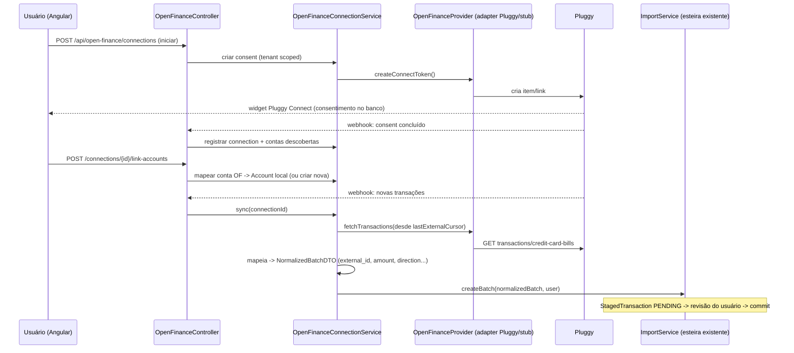

# Integração Open Finance (via agregador Pluggy) — Design

> Status: **rascunho para avaliação** (implementação pausada a pedido do usuário).
> Data: 2026-09-01

## Problem Statement

Hoje o Fintech Core só ingere dados financeiros por importação manual de arquivos
(CSV/OFX/PDF/imagem) via `ImportService`. Queremos conectar contas bancárias e cartões de
crédito dos usuários automaticamente via Open Finance (Open Banking Brasil), para que transações
e faturas cheguem sem upload manual, passando pela **mesma esteira de revisão (staging)** antes de
virarem lançamentos reais.

## Decisões fechadas com o usuário

- **Acesso via agregador comercial PLUGGY** (participante credenciado no Diretório do BC). Sem
  credenciamento direto no Banco Central, sem certificados ICP-Brasil/mTLS do nosso lado — o
  agregador cuida disso.
- **Escopo:** leitura de contas + transações + cartão de crédito/faturas. Sem iniciação de
  pagamento (Pix/PISP) nesta fase.
- **Todo dado sincronizado passa pela esteira de staging existente** — usuário revisa e confirma
  antes de virar `Transaction`. SEM auto-commit.
- **Pluggy escolhida por custo** (projeto sem receita inicial): sandbox gratuito e self-service,
  +130 instituições BR com cartões/faturas no mesmo schema, webhook em vez de polling, docs
  PT-BR. Widget = Pluggy Connect.

## Arquitetura existente (confirmada por leitura de código)

- Pipeline: `TransactionExtractor` (file-based, síncrono) → `NormalizedBatchDTO` →
  `ImportService.createBatch(...)` → `StagedTransaction` (PENDING) → revisão/edição/discard →
  `commit()` → `TransactionService.create(...)`.
- `NormalizedBatchDTO`/`NormalizedTransactionDTO` usam campos `StagedFieldValue{value,
  confidence}`: `amount`, `direction` (debit/credit), `transaction_date`, `description`,
  `currency`, `external_id`. `external_id` é a chave forte de dedup intra-batch (no OFX é o
  `FITID`).
- `OfxExtractor` é o análogo mais próximo: dado estruturado de banco, confiança 1.0 nos campos.
  Open Finance é essencialmente "OFX ao vivo via API".
- `NormalizedBatchDTO` tem `targetInvoiceReferenceYear/Month` para ancorar batch de fatura de
  cartão (hoje usado só pelo `ItauFaturaTemplate`); `ImportService.commit` usa isso para rotear
  lançamentos de cartão para a fatura correta.
- `ImportSourceType` enum = `{IMAGE, PDF_TEXT, PDF_SCANNED, CSV, OFX, AUDIO}` — precisa de
  `OPEN_FINANCE`.
- `Account` tem: `name`, `type` (`AccountType`), `color`, `icon`, `countInLiquidBalance`,
  `countInNetWorth`, `active`, `tenant`, `createdBy`.

## Decisão de design central

**NÃO** forçar Open Finance dentro do `TransactionExtractor` (porta file-based e síncrona,
`ExtractionInput` = bytes). Open Finance começa com consentimento OAuth (redirect/widget),
sincroniza de forma assíncrona (webhook/polling), e o dado vem de HTTP. Criar camada nova
`service/openfinance/` que:

1. Gerencia conexões (consentimento + contas vinculadas + estado de sync), sempre scoped por
   tenant.
2. Fala com o agregador por trás de uma porta própria `OpenFinanceProvider` (permite swap de
   agregador por config — mesmo espírito do `TransactionExtractor`). Pluggy é o adapter concreto;
   stub é o default de desenvolvimento.
3. Converte o retorno do agregador em `NormalizedBatchDTO` e chama
   `ImportService.createBatch(...)`, reusando toda a esteira de staging/dedup/commit sem duplicar
   regra de lançamento. Dedup por `external_id` (id da transação na Pluggy) protege contra
   reprocessamento entre syncs e colisão com importações manuais.

### Fluxo de conexão e sync

## Modelo de dados novo (migrations V33+)

- `open_finance_connections` — id (UUID), tenant_id, created_by, provider (ex. PLUGGY),
  provider_item_id, institution_name, status (PENDING/ACTIVE/ERROR/DISCONNECTED),
  consent_expires_at, last_sync_at, created_at/updated_at. Tenant scoping obrigatório.
- `open_finance_linked_accounts` — id, connection_id, tenant_id, provider_account_id,
  account_type (bank/credit_card), account_id (FK → accounts local, nullable até o usuário
  vincular), last_external_cursor, created_at/updated_at.
- Segredos Pluggy (client_id/client_secret/tokens) **NUNCA** em tabela de negócio nem em log —
  via properties/secret store, referenciados por nome.

## Contrato de API (spec-first)

Editar `api-spec/openapi.yaml` primeiro. Todos DTOs (nunca entidades), scoping por tenant, 403
para roles não autorizadas.

- `POST /api/open-finance/connections` — inicia conexão, retorna connect token/URL do Pluggy Connect
- `POST /api/open-finance/webhook` — recebe eventos da Pluggy (com validação de assinatura)
- `GET /api/open-finance/connections` — lista conexões do tenant
- `POST /api/open-finance/connections/{id}/link-accounts` — vincula conta OF a Account local
- `POST /api/open-finance/connections/{id}/sync` — dispara sync manual
- `DELETE /api/open-finance/connections/{id}` — revoga consentimento e desconecta

## Task Breakdown

- **Task 1 — Fundação de domínio e migrations.** Enum `ImportSourceType.OPEN_FINANCE`, entidades
  `OpenFinanceConnection`/`OpenFinanceLinkedAccount` (em `domain/openfinance/`), enum
  `OpenFinanceConnectionStatus` (PENDING/ACTIVE/ERROR/DISCONNECTED), repositórios Spring Data com
  tenant scoping (`findByIdAndTenant`, `findByTenantOrderBy...`), migrations Flyway V33/V34.
  Padrão de tenant denormalizado como no `StagedTransaction`; migrations imutáveis; UUID como id.
- **Task 2 — Porta `OpenFinanceProvider` + adapter stub (default) + esqueleto Pluggy.** Interface
  (createConnectToken, fetchAccounts, fetchTransactions desde cursor, fetchCreditCardBills,
  revokeConsent), stub selecionável por property (`openfinance.provider`, default=stub),
  esqueleto `PluggyProvider` (client_id/secret via properties, nunca logados) ativado por
  `openfinance.provider=pluggy`. Stub retorna payloads fixos (sem SDK/custo).
- **Task 3 — `OpenFinanceMapper` → `NormalizedBatchDTO`.** Confiança 1.0 (como OFX), external_id
  = id da transação na Pluggy, direction pelo sinal do valor, amount/transaction_date/
  description/currency; fatura de cartão via `targetInvoiceReference`. Mapeamento puro, não toca
  banco; campos ausentes zeram confiança.
- **Task 4 — `OpenFinanceConnectionService` + `OpenFinanceController`.** Criar conexão (gera
  connect token), registrar contas descobertas, listar/desconectar (revoga consentimento), scoped
  por `user.getTenant()`. Controller fino; DTOs no boundary; segredos nunca logados. Controller
  test com 403.
- **Task 5 — Vínculo de conta OF → `Account` local.** `POST /connections/{id}/link-accounts`
  mapeia cada conta descoberta a uma `Account` existente ou cria nova (respeitando `AccountType`,
  `countInLiquidBalance`, `countInNetWorth`). Sem vínculo, a conta OF não sincroniza.
- **Task 6 — Sync de transações reusando a esteira de staging.** `syncConnection(id, user)` busca
  desde `last_external_cursor`, mapeia, chama `ImportService.createBatch(...)` com
  `sourceType=OPEN_FINANCE`; atualiza cursor/last_sync_at. Dedup por external_id; SEM auto-commit
  (fica PENDING).
- **Task 7 — Sync de faturas de cartão de crédito.** Mapear faturas/lançamentos de cartão via
  `targetInvoiceReferenceYear/Month` (como o `ItauFaturaTemplate`). Reusa a lógica de fatura do
  `ImportService.commit`, sem reimplementar lifecycle de invoice.
- **Task 8 — Webhook Pluggy com validação de assinatura.** `POST /api/open-finance/webhook`
  valida assinatura, identifica a connection (por `provider_item_id`), dispara sync assíncrono;
  trata eventos de consentimento aprovado/expirado e item/transações atualizadas. Payload como
  untrusted; rejeita assinatura inválida; sem vazar segredo em log.
- **Task 9 — Frontend feature `open-finance` (Angular 21, signals) com Pluggy Connect.** Feature
  lazy-loaded (`frontend/src/app/features/open-finance/`): conectar banco (widget Pluggy Connect
  com o connect token), listar conexões/status, vincular contas, disparar sync manual. Client
  Orval regenerado; signals-first; sem `any`; funções puras de estado em arquivos sem imports
  Angular para teste com Vitest.
- **Task 10 — Integração fim-a-fim e regeneração de contratos.** `openapi.yaml` atualizado,
  regenerar interfaces backend (`./mvnw generate-sources`) e client frontend (`npm run
  api:generate`), copiar spec para `backend/src/main/resources/static/openapi.yaml`, garantir
  sync → staging → commit ponta a ponta com o stub. Rodar `./mvnw test` e `npm test`.

## Notas para execução

- Regulatório/contratual (contrato Pluggy, LGPD, termos de consentimento) é decisão de negócio,
  fora do escopo de código. O plano assume Pluggy contratada/sandbox à parte.
- Começar SEMPRE com o stub como default (`openfinance.provider=stub`) para desenvolver Tasks
  1–10 sem custo nem dependência de credencial. O adapter Pluggy real (SDK/formato de webhook/
  assinatura) é ativado por config quando as credenciais estiverem disponíveis.
- Confirmar pricing de produção da Pluggy (por conexão/consentimento ativo) antes do go-live —
  desenvolvimento/sandbox é gratuito.
- Manter a fronteira existente: mapeadores/providers não tocam banco; persistência fica no
  service; nenhuma regra de lançamento é reimplementada (reusa `ImportService`/
  `TransactionService`).

## Estado da implementação (pausada em 2026-09-01)

Já criados em disco na Task 1 (parcial), pendentes de avaliação:

- `backend/.../domain/enums/ImportSourceType.java` — adicionado valor `OPEN_FINANCE`.
- `backend/.../domain/enums/OpenFinanceConnectionStatus.java` — novo enum.
- `backend/.../domain/openfinance/OpenFinanceConnection.java` — nova entidade.
- `backend/.../domain/openfinance/OpenFinanceLinkedAccount.java` — nova entidade.

Ainda **não** criados: repositórios, migrations V33/V34, e todo o restante (Tasks 2–10).
