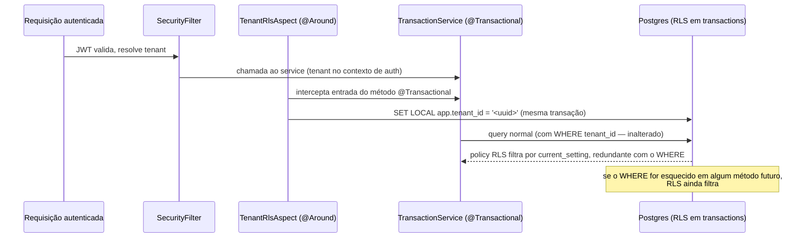

# RLS Postgres — PoC em `transactions` — Design

> Status: aprovado para execução.
> Data: 2026-09-02
> Decisão: `docs/adr/ADR-006-rls-postgres-defesa-em-profundidade.md`

## Problem Statement

Isolamento multi-tenant hoje é só `WHERE tenant_id = :tenantId` na aplicação (repositórios
Spring Data). Nenhuma garantia no banco. Objetivo deste PoC: provar, com teste discriminante,
que uma policy RLS no Postgres bloqueia vazamento de tenant **mesmo quando a aplicação
"esquece" o filtro** — na tabela `transactions`, escolhida por ser a mais sensível e a mais
testada do domínio.

## Arquitetura existente (confirmada por leitura de código)

- `SecurityFilter` (`backend/src/main/java/com/fintech/api/config/SecurityFilter.java`)
  resolve o tenant autenticado por requisição e já o publica no MDC (`tenantId`).
- Camada `Controller → Service → Repository`; todo acesso a `Transaction` passa por método de
  `TransactionService` anotado `@Transactional` (padrão do projeto,
  `fintech-core-architecture-contract`).
- Testes de integração usam `@SpringBootTest` contra Postgres real (não H2/Testcontainers
  preferível conforme convenção — confirmar mecanismo de banco do teste no plano).
- Pool de conexões HikariCP — conexões são reusadas entre transações, por isso `SET LOCAL`
  (escopo de transação) e não `SET` (escopo de sessão/conexão).

## Decisão de design central

Ver ADR-006. Resumo: `ENABLE` + `FORCE ROW LEVEL SECURITY` + policy `USING (tenant_id =
current_setting('app.tenant_id')::uuid)` em `transactions`; `SET LOCAL app.tenant_id` via
Spring AOP `@Around` num aspect que envolve a execução de métodos `@Transactional` dos
services que tocam `Transaction`, lendo o tenant do contexto de autenticação já resolvido pelo
`SecurityFilter`.

### Fluxo

## Escopo

**Dentro:**
- Migration V33: `ENABLE`/`FORCE ROW LEVEL SECURITY` + policy em `transactions`.
- `TenantRlsAspect`: aspect Spring AOP em torno dos métodos `@Transactional` de
  `TransactionService` (escopo do PoC — não todos os services ainda).
- Teste discriminante de integração: prova RLS bloqueando vazamento com filtro de app
  deliberadamente ausente.
- Teste de regressão: suíte existente de `TransactionService`/`TransactionController`
  permanece verde (RLS não pode quebrar comportamento correto de tenant único).

**Fora (fase 2, não deste PoC):**
- Rollout para `accounts`, `categories`, `budget_items`, `invoices`, demais tabelas de
  negócio.
- Aspect genérico aplicável a qualquer service (o PoC cobre só `TransactionService`).
- Mudança de mecanismo de teste de integração (Testcontainers vs. Postgres local) — usa o que
  já existe.

## Modelo de dados

Nenhuma tabela/coluna nova. Só a migration de policy (V33) — sem impacto em
`database-schema.md` além de registrar a versão. Dataset de testes: **sem alteração**
necessária (nenhuma tabela/coluna nova; `dataset.md` seção "Feature puramente
frontend/refatoração sem schema" não se aplica exatamente, mas o efeito é o mesmo — nenhum
INSERT novo é exigido, o dataset seed já tem 2+ tenants distintos para o teste discriminante,
a confirmar no plano).

## Contrato de API

Nenhum. RLS é interno, não observável pelo frontend nem pelo `openapi.yaml`.

## Task Breakdown

- **Task 1 — Migration V33.** `ENABLE`/`FORCE ROW LEVEL SECURITY` + `CREATE POLICY` em
  `transactions`. Sem policy, nenhuma sessão sem `app.tenant_id` setado consegue ler/escrever
  (inclusive testes existentes — por isso Task 2 vem atrelada, não pode haver gap entre elas
  num mesmo commit/PR).
- **Task 2 — `TenantRlsAspect`.** `@Around` nos métodos públicos `@Transactional` de
  `TransactionService` **e** em `InvoiceService.pay` (achado real de implementação: `pay`
  grava em `transactions` direto pelo repositório, sem passar por `TransactionService` — sem
  cobri-lo, pagar fatura em produção quebraria com RLS ativo); executa
  `SET LOCAL app.tenant_id = ?` via `EntityManager`/JDBC (`Session.doWork`) antes do corpo do
  método; tenant lido do parâmetro `User` que cada método interceptado já recebe (não do
  `SecurityContextHolder` — decisão revisada durante a implementação, ver ADR-006).
- **Task 3 — Teste discriminante.** Query nativa (`EntityManager.createNativeQuery`) que
  **não** aplica `WHERE tenant_id`, executada dentro de uma transação com `app.tenant_id`
  setado para o tenant A, contra dataset com tenant A e tenant B populados — deve retornar
  **0** linhas do tenant B. Mesmo teste com a policy desabilitada (ou aspect removido, a
  decidir) deve retornar N > 0 — prova que é a policy, não o filtro de app, bloqueando.
- **Task 4 — Regressão.** Suíte completa de `TransactionService`/`TransactionControllerTest`
  verde com RLS ativo — garante que o aspect cobre 100% dos métodos que hoje tocam
  `transactions` (nenhuma query "esquecida" fora de transação com tenant setado).
- **Task 5 — Documentação.** `database-schema.md` (nova migration V33), `architecture.md` ou
  novo trecho referenciando o ADR-006, `ADR-006` já commitado nesta sessão.

## Notas para execução

- Baseline verde obrigatória antes de começar (regra do change-control) — rodar a suíte
  completa na worktree antes da Task 1.
- Se a Task 4 revelar métodos de `TransactionService` chamados fora de contexto
  `@Transactional` (ex.: chamada direta a repositório em outro service), tratar como achado
  do PoC, não como bug a esconder — documentar no plano/PR.
- `FORCE ROW LEVEL SECURITY` afeta também o usuário owner da tabela — confirmar se o seed
  Flyway (`V13`/etc, populados por esse mesmo usuário/role de app no `docker-compose.yml`)
  ainda aplica corretamente; se o seed rodar como o mesmo role da aplicação, ele também será
  barrado pela policy e precisará de tratamento (ex.: `SET LOCAL app.tenant_id` explícito nos
  scripts de seed, ou um role de superusuário separado para migration/seed vs. runtime da
  app — decidir no plano, é um risco real e não cosmético).
